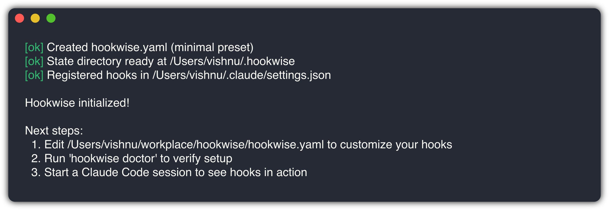
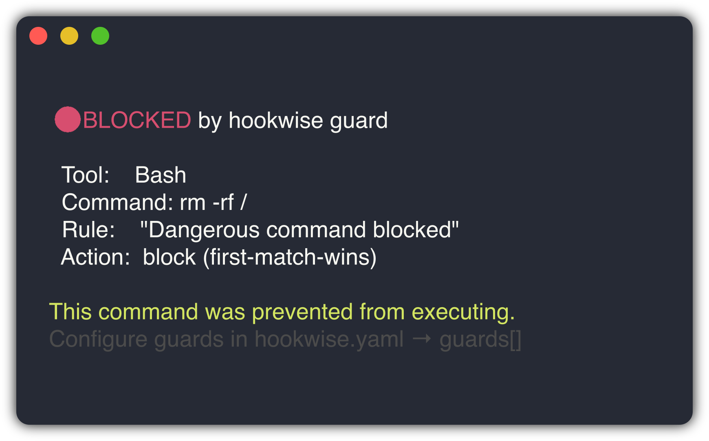
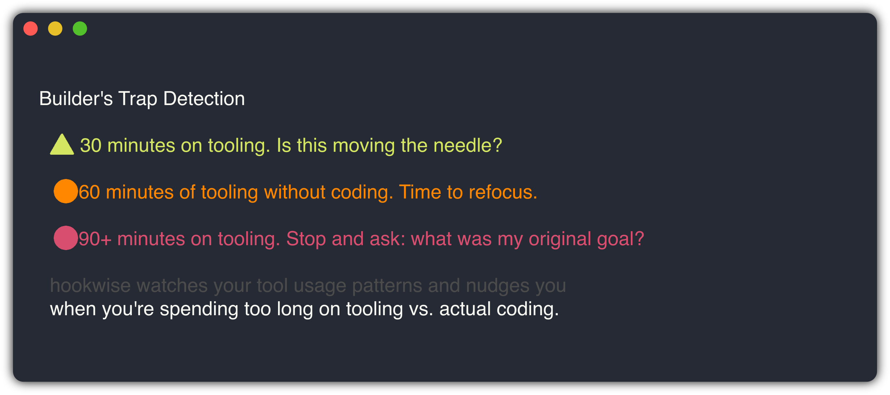
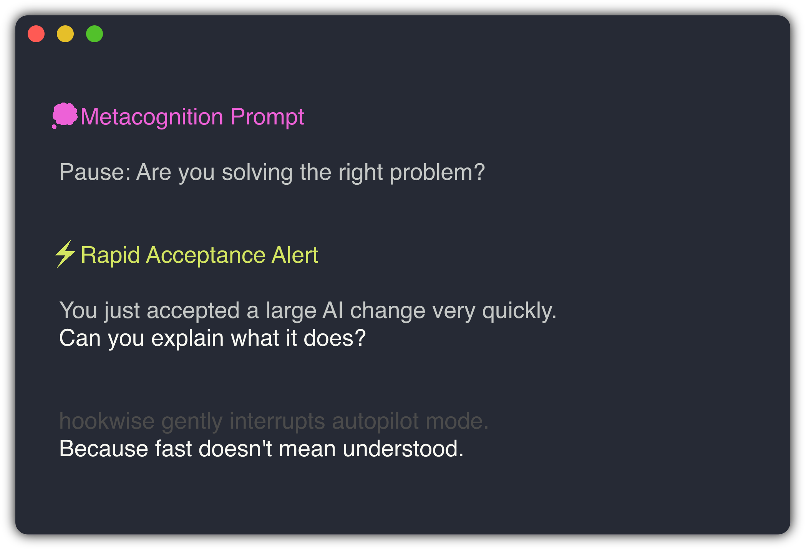
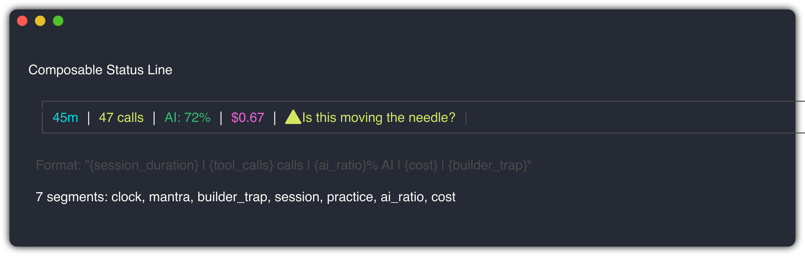
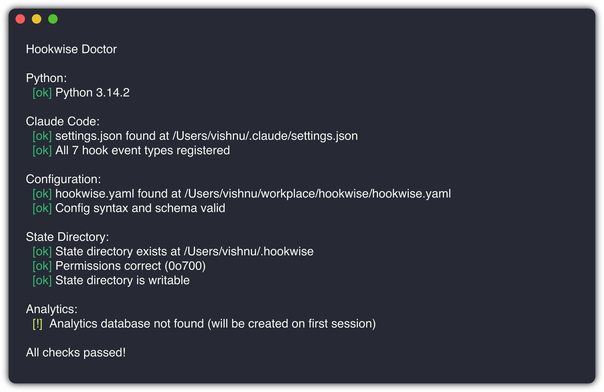
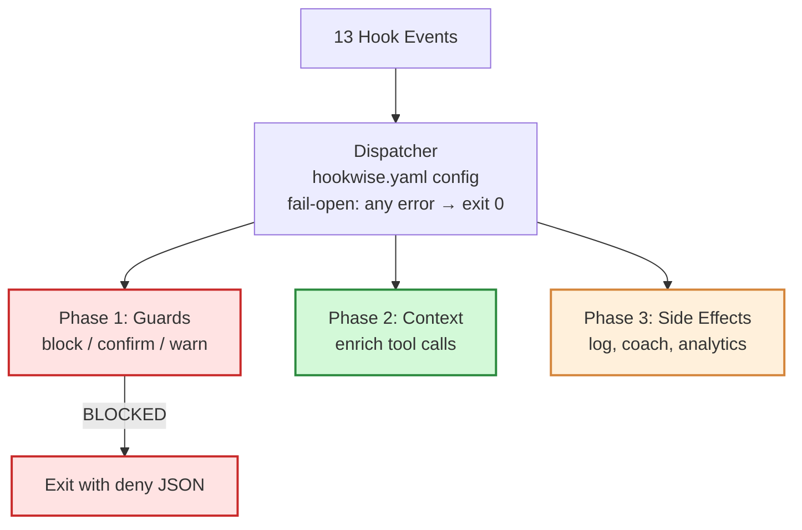
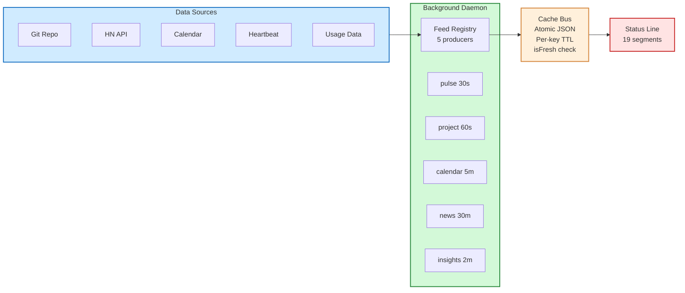

<div align="center">

```
 _                 _            _
| |__   ___   ___ | | ____      _(_)___  ___
| '_ \ / _ \ / _ \| |/ /\ \ /\ / / / __|/ _ \
| | | | (_) | (_) |   <  \ V  V /| \__ \  __/
|_| |_|\___/ \___/|_|\_\  \_/\_/ |_|___/\___|
```

**Config-driven hook framework for Claude Code**

Guard rails, coaching, analytics, and an interactive TUI -- all from one YAML file.

[](https://www.npmjs.com/package/hookwise)
[](https://github.com/vishnujayvel/hookwise/actions)
[]()
[](LICENSE)
[](https://nodejs.org)
[](https://www.typescriptlang.org/)

</div>

---

## The Problem

You are pair-programming with Claude Code. It is 2am, you are in the zone, and your AI just ran `rm -rf /` while you were reading its previous output. Or it force-pushed to main. Or it has been "refactoring" the build system for 90 minutes while you assumed it was working on the feature.

Claude Code has a [hooks system](https://docs.anthropic.com/en/docs/claude-code/hooks) -- shell commands that fire on 13 different hook events. But writing hook scripts by hand means a pile of bash files, no consistency, and no way to share what works.

**hookwise** is one YAML file. Guards, analytics, coaching -- all in one place.

## Philosophy

I built hookwise because I kept waking up to disasters.

Not "my server is down" disasters — "my AI rewrote the build system while I was making coffee" disasters. Claude Code is extraordinary. It can refactor an entire module, set up infrastructure, write tests — all while you are reading the previous diff. That power is exactly why it needs guard rails.

The existing hooks system is powerful but raw. You write bash scripts, scatter them across your config, and hope they cover the right events. There is no testing, no sharing, and no way to know if your guards actually work until something slips through.

**hookwise is one YAML file that replaces all of that.** Declarative guards that read like firewall rules. Analytics that tell you where your time actually goes. Coaching that nudges you when you have been in "tooling mode" for 90 minutes and forgot your original goal.

The design principle is simple: **your AI should never be the reason you cannot sleep.** Everything in hookwise serves that principle — guards protect, context enriches, side effects observe. If any part of hookwise itself errors, it fails open. hookwise must never be the thing that breaks your flow.

> *"Guard rails should be boring. The exciting part is what you build when you are not worried about what your AI is doing."*

## Quick Start

```bash
# Install globally
npm install -g hookwise

# Initialize in your project
hookwise init --preset minimal

# Verify everything works
hookwise doctor
```

<div align="center">

</div>

This creates `hookwise.yaml` in your project root and sets up the state directory. Then register hookwise in your Claude Code settings:

```json
{
  "hooks": {
    "PreToolUse": [{ "command": "hookwise dispatch PreToolUse" }],
    "PostToolUse": [{ "command": "hookwise dispatch PostToolUse" }],
    "SessionStart": [{ "command": "hookwise dispatch SessionStart" }],
    "SessionEnd": [{ "command": "hookwise dispatch SessionEnd" }],
    "Stop": [{ "command": "hookwise dispatch Stop" }],
    "Notification": [{ "command": "hookwise dispatch Notification" }],
    "SubagentStop": [{ "command": "hookwise dispatch SubagentStop" }]
  }
}
```

## Configuration

Everything lives in `hookwise.yaml`:

```yaml
version: 1

# Guard rules -- first match wins, like a firewall
guards:
  - match: "Bash"
    action: block
    when: 'tool_input.command contains "rm -rf"'
    reason: "Dangerous command blocked"

  - match: "Bash"
    action: confirm
    when: 'tool_input.command contains "--force"'
    reason: "Force flag requires confirmation"

  - match: "Read"
    action: warn
    when: 'tool_input.file_path ends_with ".env"'
    reason: "Accessing .env file -- may contain secrets"

  - match: "mcp__gmail__*"
    action: confirm
    reason: "Gmail tool requires confirmation"

# Ambient coaching -- nudges, not interruptions
coaching:
  metacognition:
    enabled: true
    interval_seconds: 300
  builder_trap:
    enabled: true
    thresholds:
      yellow: 30
      orange: 60
      red: 90

# Session analytics -- SQLite, queryable
analytics:
  enabled: true

# Cost tracking -- no surprise bills
cost_tracking:
  enabled: true
  daily_budget: 10
  enforcement: warn

# Status line -- pick your segments
status_line:
  enabled: true
  segments:
    - ai_ratio
    - session
    - builder_trap
    - cost

# Include recipes for reusable patterns
includes:
  - recipes/safety/block-dangerous-commands
  - recipes/behavioral/metacognition-prompts
```

### Presets

| Preset | What you get |
|--------|-------------|
| `minimal` | Guards only -- just the safety rails |
| `coaching` | Guards + metacognition + builder's trap + status line |
| `analytics` | Guards + SQLite session tracking |
| `full` | Everything enabled |

## Features

### Guard Rails

Declarative rules evaluated on every `PreToolUse` event. First matching rule wins (firewall semantics).

| Operator | Example |
|----------|---------|
| `contains` | `tool_input.command contains "rm -rf"` |
| `starts_with` | `tool_input.file_path starts_with "/etc"` |
| `ends_with` | `tool_input.file_path ends_with ".env"` |
| `equals` / `==` | `tool_name equals "Bash"` |
| `matches` | `tool_input.command matches "git push.*--force"` |

Three actions: **block** (reject the tool call), **confirm** (reserved, currently behaves as block), **warn** (log and continue).

<div align="center">

</div>

> **Note:** In v1.0, `confirm` behaves identically to `block`. Claude Code hooks do not support interactive confirmation dialogs. The `confirm` action is reserved for future use when Claude Code adds confirmation support.

Glob patterns for tool names: `mcp__gmail__*` matches all Gmail MCP tools.

### Builder's Trap Detection

Monitors your tool usage patterns and categorizes them as coding, reviewing, or tooling. When you have been in "tooling mode" too long:

- **30 min** -- Yellow: "Is this moving the needle?"
- **60 min** -- Orange: "Time to refocus."
- **90 min** -- Red: "Stop and ask: what was my original goal?"

<div align="center">

</div>

### Metacognition Coaching

Periodic prompts that interrupt autopilot mode:

- "Pause: Are you solving the right problem?"
- "What would you explain to a junior dev about this change?"
- "You just accepted a large AI change very quickly. Can you explain what it does?"

<div align="center">

</div>

### Communication Coach

Grammar and communication analysis for interview prep and professional writing.

### Session Analytics

SQLite-backed tracking with `hookwise stats`:

- Session duration and tool call counts
- AI-vs-human authorship ratio with AI Confidence Score
- Tool breakdown by category
- Cost tracking with daily budget enforcement

<div align="center">

</div>

### Feed Platform

A background daemon polls feed producers on configurable intervals and writes results to an atomic cache bus. Status line segments read from the cache using TTL-aware freshness checks (`isFresh()`). If a feed is unavailable or stale, its segments silently disappear (fail-open).

5 built-in feed producers:

| Producer | Default Interval | What it provides |
|----------|-----------------|-----------------|
| `pulse` | 30s | Session heartbeat and idle time detection |
| `project` | 60s | Git repo name, branch, last commit age |
| `calendar` | 300s | Current/next calendar event and free time |
| `news` | 1800s | Hacker News top stories (rotates) |
| `insights` | 120s | Claude Code usage metrics from `~/.claude/usage-data/` |

Configure feeds in `hookwise.yaml`:

```yaml
feeds:
  pulse:
    enabled: true
    interval_seconds: 30
  project:
    enabled: true
    interval_seconds: 60
  insights:
    enabled: true
    interval_seconds: 120
    staleness_days: 30
    usage_data_path: "~/.claude/usage-data"
```

The daemon starts automatically with `hookwise dispatch` and shuts down after 120 minutes of inactivity.

#### Insights Producer

The insights producer reads Claude Code's usage data from `~/.claude/usage-data/` (session-meta and facets JSON files), aggregates metrics within a configurable staleness window, and writes them to the cache bus under the `insights` key.

**Aggregated metrics:**
- `total_sessions` -- count of sessions within the staleness window
- `total_messages` -- sum of user messages across sessions
- `total_lines_added` -- sum of lines added across sessions
- `avg_duration_minutes` -- mean session duration
- `top_tools` -- top 5 tools by total call count
- `friction_counts` -- aggregated friction categories (e.g., `{wrong_approach: 32, misunderstood_request: 14}`)
- `friction_total` -- sum of all friction instances
- `peak_hour` -- hour (0-23) with the most messages
- `days_active` -- unique calendar dates with at least one session
- `recent_session` -- most recent session summary (id, duration, lines added, friction count, outcome, tool errors)

**Self-cleaning:** Only sessions within the staleness window (default: 30 days) are included. Facets without a matching valid session are excluded. No manual cleanup needed.

**Configuration:**

| Field | Type | Default | Description |
|-------|------|---------|-------------|
| `enabled` | boolean | `true` | Enable/disable the insights producer |
| `interval_seconds` | number | `120` | Polling interval in seconds |
| `staleness_days` | number | `30` | Only include sessions newer than this many days |
| `usage_data_path` | string | `~/.claude/usage-data` | Path to Claude Code usage data directory |

**Fail-open behavior:** Missing directory, malformed JSON files, and permission errors all result in graceful degradation -- the producer returns null and segments disappear.

### Composable Status Line

16 segments you can mix and match:

<div align="center">

</div>

**Core segments:**

| Segment | Shows |
|---------|-------|
| `clock` | Current time |
| `session` | Duration + tool count |
| `ai_ratio` | AI-generated code percentage |
| `cost` | Session cost estimate |
| `builder_trap` | Alert level + nudge message |
| `mantra` | Rotating motivational prompt |
| `practice` | Daily practice rep counter |

**Two-tier segments:**

| Segment | Shows |
|---------|-------|
| `context_bar` | Context window usage bar |
| `mode_badge` | Current mode (coding/tooling/etc.) |
| `duration` | Total session duration |
| `practice_breadcrumb` | Time since last practice |

**Feed platform segments:**

| Segment | Shows |
|---------|-------|
| `pulse` | Session heartbeat |
| `project` | Repo + branch + last commit |
| `calendar` | Current/next event |
| `news` | Hacker News headlines |

**Insights segments:**

| Segment | Shows |
|---------|-------|
| `insights_friction` | Friction health: warns on recent friction, shows clean status otherwise |
| `insights_pace` | Productivity: messages/day, total lines, session count |
| `insights_trend` | Patterns: top tools and peak coding hour |

### Interactive TUI

Full-screen terminal UI built with Python Textual — 8 tabs:

| Key | Tab | Description |
|-----|-----|-------------|
| `1` | Dashboard | Feature overview with enabled/disabled status |
| `2` | Guards | Guard rules table with action descriptions |
| `3` | Coaching | Coaching features with user-friendly explanations |
| `4` | Analytics | Sparkline trends, AI authorship ratio, tool breakdown |
| `5` | Feeds | Live feed dashboard with auto-refresh and health indicators |
| `6` | Insights | Claude Code usage metrics, trends, and daily AI summary |
| `7` | Recipes | Recipe browser grouped by category |
| `8` | Status | Status line preview and segment configurator |

Press `q` to exit the TUI. Install: `cd tui && pip install -e .`

## Recipes

12 built-in recipes -- pre-configured patterns for common needs:

| Recipe | Category | What it does |
|--------|----------|-------------|
| `block-dangerous-commands` | safety | Blocks `rm -rf /`, `rm -rf ~`, force pushes |
| `secret-scanning` | safety | Detects and masks secrets in tool output |
| `ai-dependency-tracker` | behavioral | Tracks AI usage patterns over time |
| `metacognition-prompts` | behavioral | Periodic "step back and think" nudges |
| `builder-trap-detection` | behavioral | Detects over-engineering and scope creep |
| `cost-tracking` | compliance | API costs against daily budgets |
| `transcript-backup` | productivity | Saves session transcripts for review |
| `context-window-monitor` | productivity | Monitors context window usage |
| `friction-alert` | productivity | Warns when friction patterns exceed threshold in recent sessions |
| `streak-tracker` | gamification | Tracks coding streaks and consistency |
| `commit-without-tests` | quality | Warns when committing without running tests |
| `file-creation-police` | quality | Enforces file creation policies |

Include a recipe in your config:

```yaml
includes:
  - recipes/safety/block-dangerous-commands
  - recipes/behavioral/metacognition-prompts
```

Or create your own -- see [Creating a Recipe](docs/creating-a-recipe.md).

## CLI Commands

```
hookwise init [--preset minimal|coaching|analytics|full]
                          Generate hookwise.yaml and state directory

hookwise doctor           Health check: config, state dir, handlers
```

<div align="center">

</div>

```
hookwise status           Show current configuration summary

hookwise stats            Session analytics: tool calls, authorship, cost

hookwise test             Run guard rule tests against scenarios

hookwise tui              Launch the interactive TUI for config management

hookwise migrate          Migrate from Python hookwise (v0.1.0) to TypeScript
```

## Testing Your Guards

hookwise includes testing utilities so you can validate guards in CI:

```typescript
import { GuardTester } from "hookwise/testing";

const tester = new GuardTester("hookwise.yaml");

// Test blocking
const blocked = tester.evaluate("Bash", { command: "rm -rf /" });
expect(blocked.action).toBe("block");

// Test allowing
const allowed = tester.evaluate("Bash", { command: "ls -la" });
expect(allowed.action).toBe("allow");
```

Three testing utilities are exported:

- **`GuardTester`** -- In-process guard rule evaluation (fast, no subprocess)
- **`HookRunner`** -- Subprocess-based hook execution (tests the real dispatch path)
- **`HookResult`** -- Assertion helpers (`assertBlocked()`, `assertAllowed()`, `assertWarns()`)

## Architecture

hookwise registers one dispatcher for all 13 Claude Code hook events:

> **Diagram source:** [three-phase-engine.excalidraw](docs/assets/three-phase-engine.excalidraw) — open in [Excalidraw](https://excalidraw.com) for an editable hand-drawn version.



**Three-phase execution:**

1. **Guards** -- Decide if the tool call should proceed. First block wins (short-circuit). If any guard blocks, phases 2 and 3 are skipped.
2. **Context Injection** -- Enrich the tool call with additional context (greeting, metacognition prompts). Multiple context handlers merge their output.
3. **Side Effects** -- Non-blocking operations that observe and respond (analytics, coaching state, sounds, transcript backup).

**Fail-open guarantee:** Any unhandled exception anywhere in the dispatch pipeline results in `exit 0`. hookwise must never accidentally block a tool call due to internal errors.

### Feed Platform Architecture

> **Diagram source:** [feed-platform.excalidraw](docs/assets/feed-platform.excalidraw) — open in [Excalidraw](https://excalidraw.com) for an editable hand-drawn version.



**Config resolution:**
1. Global config (`~/.hookwise/config.yaml`)
2. Project config (`./hookwise.yaml`)
3. Deep merge: project values override global
4. Include resolution (recipes)
5. v0.1.0 backward compatibility transform
6. snake_case to camelCase conversion
7. Environment variable interpolation (`${VAR_NAME}`)
8. Defaults fill missing fields

## How It Compares

| | hookwise | Status line tools | Raw hook scripts |
|---|---------|------------------|-----------------|
| Guard rails | Declarative YAML | No | Manual bash |
| Session analytics | SQLite, queryable | Display-only | DIY |
| Coaching | Built-in | No | No |
| Configuration | One YAML file | JSON/TUI | Scattered scripts |
| Testing | GuardTester, HookRunner | N/A | Manual |
| Recipes | 12 built-in | N/A | N/A |
| Cost tracking | Budgets + alerts | Current session only | DIY |
| Interactive TUI | 8 tabs | N/A | N/A |

## Development

```bash
git clone https://github.com/vishnujayvel/hookwise.git
cd hookwise
npm install
npm test          # 1363 tests via vitest
npm run build     # tsup build
npm run typecheck  # tsc --noEmit
```

### Project Structure

```
src/
  core/           # Dispatcher, config, guards, analytics, coaching
    analytics/    # SQLite analytics engine
    coaching/     # Metacognition, builder's trap, communication
    feeds/        # Feed platform: producers, cache bus, registry
    status-line/  # Composable status segments
  cli/            # CLI commands (init, doctor, status, stats, test, migrate)
  testing/        # HookRunner, HookResult, GuardTester

tui/              # Interactive TUI (Python Textual)
  hookwise_tui/   # App, tabs, widgets, data readers

tests/            # 1363+ tests across 61 test files
  core/           # Unit tests for each module
  integration/    # End-to-end dispatch flow tests
  performance/    # Benchmarks and import boundary tests
  cli/            # CLI command tests

recipes/          # 12 built-in recipes
examples/         # 4 example configs (minimal, coaching, analytics, full)
```

## Documentation

- [Getting Started](docs/getting-started.md)
- [Hook Events Reference](docs/hook-events-reference.md)
- [Creating a Recipe](docs/creating-a-recipe.md)
- [TUI Guide](docs/tui-guide.md)
- [Migration from Python](docs/migration-from-python.md)
- [Contributing](CONTRIBUTING.md)

## License

[MIT](LICENSE)

## Author

Built by [Vishnu](https://github.com/vishnujayvel). Born from watching Claude Code do amazing things -- and occasionally terrifying things.
