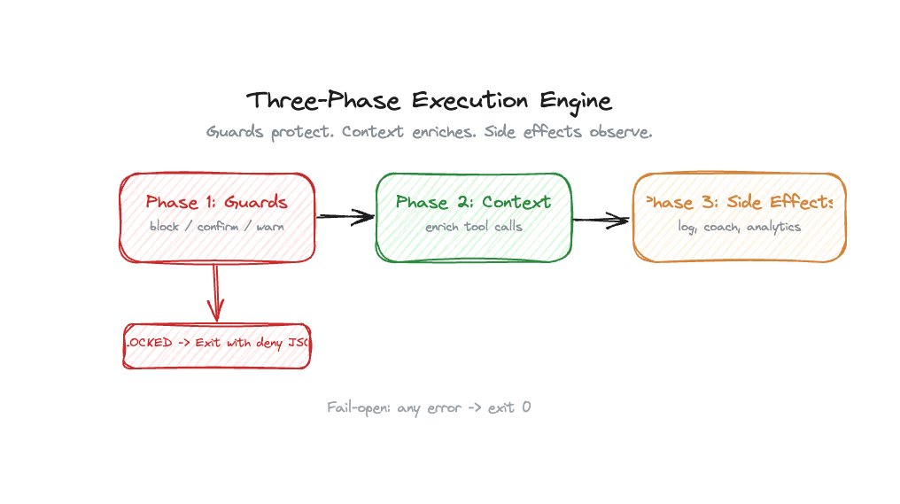
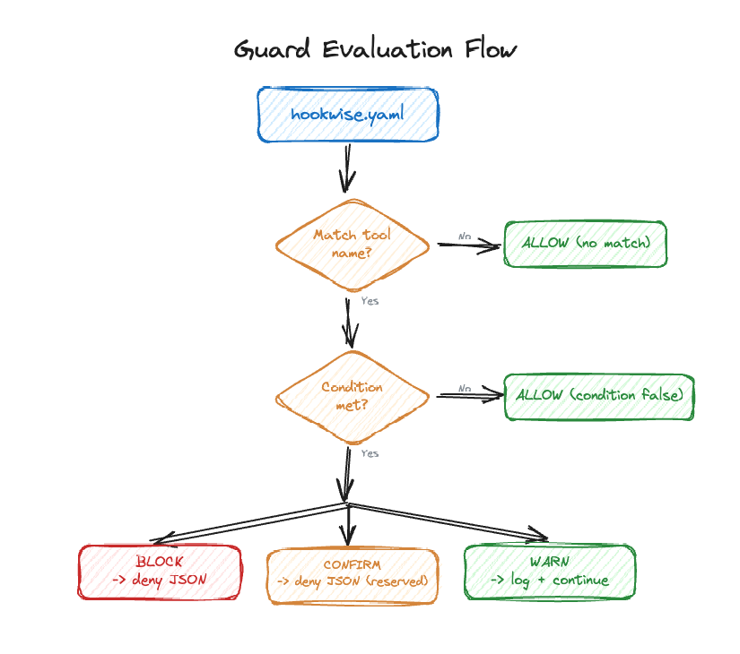
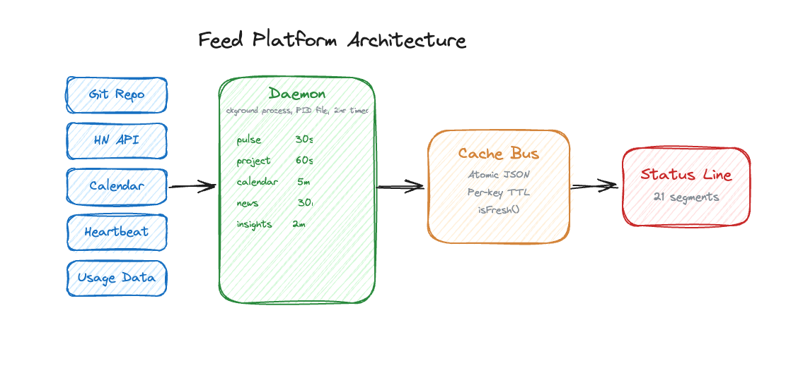

<div align="center">

```
 _                 _            _
| |__   ___   ___ | | ____      _(_)___  ___
| '_ \ / _ \ / _ \| |/ /\ \ /\ / / / __|/ _ \
| | | | (_) | (_) |   <  \ V  V /| \__ \  __/
|_| |_|\___/ \___/|_|\_\  \_/\_/ |_|___/\___|
```

**Awareness framework for AI-augmented development.**

[](https://github.com/vishnujayvel/hookwise/actions)
[](LICENSE)


</div>

## The Problem

AI coding tools are powerful. They're also making developers slower, more burned out, and less aware of what's actually happening in their workflow.

> *"Developers predicted AI would make them 24% faster. They were 19% slower. They still believed they were faster."*
> — [METR Randomized Controlled Trial](https://metr.org/blog/2025-07-10-early-2025-ai-experienced-os-dev-study/), 2025

The research is clear:

- **19% slower** with AI tools, despite feeling faster ([METR RCT, 246 real GitHub issues](https://arxiv.org/abs/2507.09089))
- **66% spend more time** fixing "almost-right" AI code ([Stack Overflow 2025, 49K+ devs](https://stackoverflow.blog/2025/12/29/developers-remain-willing-but-reluctant-to-use-ai-the-2025-developer-survey-results-are-here/))
- **Trust in AI dropped** from 40% to 29% year-over-year ([Stack Overflow 2025](https://stackoverflow.blog/2025/12/29/developers-remain-willing-but-reluctant-to-use-ai-the-2025-developer-survey-results-are-here/))

Researchers at UC Berkeley studied this for 8 months and found three forms of AI work intensification: **task expansion** (absorbing other roles), **blurred boundaries** (work becomes ambient), and **increased multitasking** (cognitive overload despite *feeling* productive). Their prescription: *intentional pauses, sequencing, and human grounding* ([HBR, Feb 2026](https://hbr.org/2026/02/ai-doesnt-reduce-work-it-intensifies-it)).

**hookwise gives you all three — as a framework, not willpower.**

## Why hookwise?

Your AI keeps you productive. hookwise keeps you **mindful**.

It's a config-driven awareness layer for [Claude Code hooks](https://docs.anthropic.com/en/docs/claude-code/hooks) — one YAML file that adds guard rails, metacognition prompts, workflow insights, and an ambient status line to every session. If hookwise errors, it fails open — your AI keeps working.

> *Guard rails should be boring. The exciting part is what you build when you're not worried about what your AI is doing.*

### Without hookwise

```bash
# .claude/settings.json — one script per guard, scattered across your project
"PreToolUse": [{ "command": "bash scripts/check-rm.sh" }]

# scripts/check-rm.sh  (repeat for every rule...)
#!/bin/bash
INPUT=$(cat)
CMD=$(echo "$INPUT" | jq -r '.tool_input.command // ""')
if echo "$CMD" | grep -q "rm -rf"; then
  echo '{"decision":"block","reason":"dangerous"}'
fi
```

### With hookwise

```yaml
# hookwise.yaml — add a rule, remove a rule, done
guards:
  - match: "Bash"
    action: block
    when: 'tool_input.command contains "rm -rf"'
    reason: "Dangerous command blocked"
```

One file. Claude Code reads it, understands it, and can even help you write new rules. No bash scripts to debug.

## How It Compares

| | hookwise | Raw hook scripts | Status line tools |
|---|---------|-----------------|------------------|
| Guard rails | Declarative YAML | Manual bash | No |
| Testing | GuardTester + HookRunner | Manual | N/A |
| Analytics | SQLite, queryable | DIY | Display-only |
| Workflow insights | Friction signals, session pulse | No | No |
| Configuration | One YAML file | Scattered scripts | JSON/TUI |
| Recipes | 11 built-in, shareable | N/A | N/A |
| Cost tracking | Budgets + alerts | DIY | Current session only |

## Quick Start

```bash
# Install (macOS / Linux · arm64 or amd64):
curl -fsSL https://raw.githubusercontent.com/vishnujayvel/hookwise/main/scripts/install.sh | sh

# …or build/install with Go:
go install github.com/vishnujayvel/hookwise/cmd/hookwise@latest

hookwise init          # scaffold hookwise.yaml + inventory your existing hooks
hookwise init --wire   # wire dispatch + status line into .claude/settings.json
hookwise doctor
```

> Prebuilt binaries (darwin/linux × amd64/arm64) are published to [GitHub Releases](https://github.com/vishnujayvel/hookwise/releases). The installer grabs the right one for your platform.

<div align="center">

</div>

`hookwise doctor` checks your config, state directory, analytics DB, daemon liveness, and per-feed health — measured against the daemon's *effective* runtime config, not just what's on disk. It's honest about disabled subsystems: a feed you turned off reports as `disabled`, and $0 with cost tracking off is "expected", not a malfunction warning.

`hookwise init --wire` registers the dispatcher and status line in `.claude/settings.json` for you — idempotently, with a pre-flight safety audit, an automatic backup, and `--dry-run` / `--unwire` escape hatches. One dispatcher handles all 13 hook events. Prefer to edit settings yourself? [Manual setup &rarr;](docs/guide/getting-started.md)

Before it writes anything, `hookwise init` also inventories the hooks you already have (user settings are never modified) and saves the pre-init snapshot to `~/.hookwise/hook-audit.json`.

## How It Works

Every hook event passes through a three-phase execution engine. Guards protect, context enriches, side effects observe. If anything errors, it fails open — your AI keeps working.

<div align="center">

</div>

## What You Get

**[Guard Rails](docs/features/guards.md)** -- Declarative rules with firewall semantics. `block`, `confirm`, or `warn` with glob patterns and operators like `contains`, `matches`, `starts_with`.


<div align="center">

</div>

**Hook Audit** -- `hookwise audit` scans your Claude Code settings files and flags hook-safety issues: sprawl, missing binaries, network-dependent hooks on hot paths, and duplicate or overlapping hooks. `--json` emits a schema-versioned report for CI (exits 0 on PASS/WARN, 1 on FAIL); `--project-dir` scans a project's `.claude/` settings instead of your user-level settings.

**[Coaching](docs/features/coaching.md)** -- Periodic **metacognition prompts** that break autopilot mode: *"Are you solving the right problem, or the most interesting one?"* Research on AI-assisted programming shows students who plan before coding outperform those who jump straight to debugging ([AIED 2025](https://arxiv.org/abs/2509.03171)) — hookwise makes planning-first the default.

**[Status Line](docs/features/status-line.md)** -- Composable segments powered by a [background daemon](docs/features/feeds.md) with 6 built-in feed producers plus custom feeds. Mix `cost`, `project`, `calendar`, `weather`, `news`, `insights`, and more. Peripheral vision for your development flow — you don't stare at it, but you glance at it.


**[Workflow Insights](docs/features/feeds.md)** -- Surfaces friction patterns with actionable tips, pace metrics, and session health. The data your workflow already generates but never shows you.

**[Feed Platform](docs/features/feeds.md)** -- A background daemon polls 6 built-in producers (plus your custom feeds) on staggered intervals and writes to an atomic cache bus with per-key TTL. Status line segments read from cache with `isFresh()` checks. If a feed is unavailable or stale, its segments silently disappear (fail-open). The daemon is a singleton shared by every project, so feeds are configured once, in the global `~/.hookwise/config.yaml` — `hookwise doctor` reports feed health against the daemon's *actual* runtime config and warns if a project file carries a `feeds:` block (which the daemon ignores).

<div align="center">

</div>

**[Analytics](docs/features/analytics.md)** -- SQLite-backed session tracking: tool calls, duration, cost, daily budgets. Close the perception gap between how fast you *feel* and how fast you *are*.


**[Interactive TUI](docs/cli.md)** _(optional · experimental)_ -- A full-screen Python/[Textual](https://textual.textualize.io) dashboard with 7 tabs. It ships **separately** from the core binary (the core CLI, guards, analytics, and status line need no Python). Install it from the `tui/` directory (e.g. `uv tool install ./tui`); once `hookwise-tui` is on your PATH, launch it on demand with `hookwise tui`, or set `tui.auto_launch: true` to open it in a separate terminal on session start.

<div align="center">

</div>

## Configuration

Everything lives in `hookwise.yaml`. [Full reference &rarr;](docs/guide/getting-started.md)

```yaml
version: 1
guards:
  - match: "Bash"
    action: block
    when: 'tool_input.command contains "rm -rf"'
    reason: "Dangerous command blocked"
coaching:
  metacognition: { enabled: true, interval_seconds: 300 }
analytics: { enabled: true }
status_line: { enabled: true, segments: [cost, project, calendar] }
```

Global config at `~/.hookwise/config.yaml` applies everywhere. Project-level `hookwise.yaml` overrides per workspace — with one exception: the `feeds:` block only takes effect in the global config, because the feed daemon is a shared singleton. A project-level `feeds:` block is ignored, and `hookwise doctor` warns about it.

## Testing

```go
import hwtesting "github.com/vishnujayvel/hookwise/pkg/hookwise/testing"

tester, err := hwtesting.NewGuardTester("hookwise.yaml")
// handle err
result := tester.Evaluate("Bash", map[string]any{"command": "rm -rf /"})
assert.Equal(t, "block", result.Action)
```

Go test helpers in `pkg/hookwise/testing`. [Details &rarr;](docs/cli.md)

## Recipes

11 built-in -- [see all](recipes/) or [create your own](docs/guide/creating-a-recipe.md):  `block-dangerous-commands`, `metacognition-prompts`, `commit-without-tests`, and more.

## Security

hookwise runs inside your Claude Code session -- security is non-negotiable. The full codebase (~80 source files) is reviewed through a dedicated security pipeline on every release:

- **4-domain parallel review** covering core engine, CLI, feed producers, and Python TUI
- **False-positive filtering** with strict exploitability criteria (confidence >= 8/10)
- **Zero confirmed vulnerabilities** in the latest full-package audit (v1.3.0)

Key design choices: parameterized SQL everywhere, safe YAML parsing only, restrictive file permissions (0o600/0o700), fail-open architecture, and Go binary releases via [GitHub Releases](https://github.com/vishnujayvel/hookwise/releases).

[Full security policy, trust model, and reporting instructions &rarr;](SECURITY.md)

## Documentation

| Guide | Reference |
|-------|-----------|
| [Getting Started](docs/guide/getting-started.md) | [Guards](docs/features/guards.md) |
| [Creating a Recipe](docs/guide/creating-a-recipe.md) | [Coaching](docs/features/coaching.md) |
| [Architecture](docs/architecture.md) | [Feeds](docs/features/feeds.md) |
| [Philosophy](docs/philosophy.md) | [Status Line](docs/features/status-line.md) |
| [CLI Reference](docs/cli.md) | [Analytics](docs/features/analytics.md) |

## Contributing

`git clone`, `go test -race ./...`, `task pr`. See [CONTRIBUTING.md](CONTRIBUTING.md).

[MIT](LICENSE) -- Built by [Vishnu](https://github.com/vishnujayvel). *Born from the gap between how fast AI makes you feel — and how fast you actually are.*