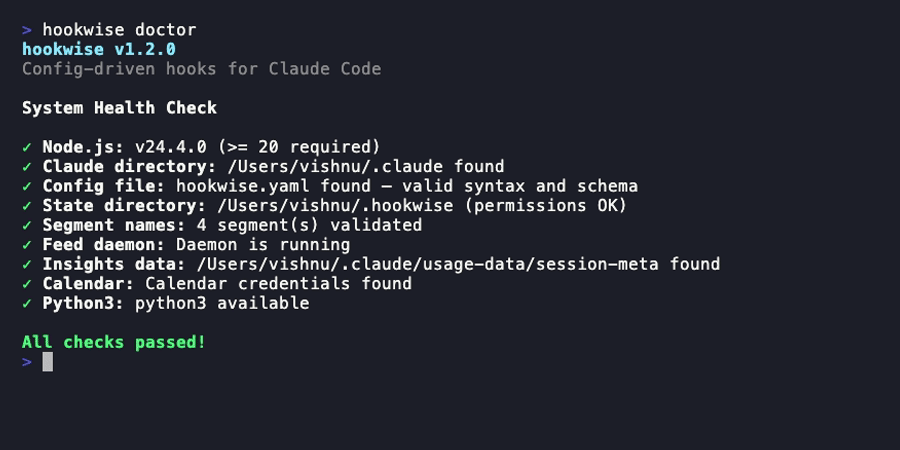
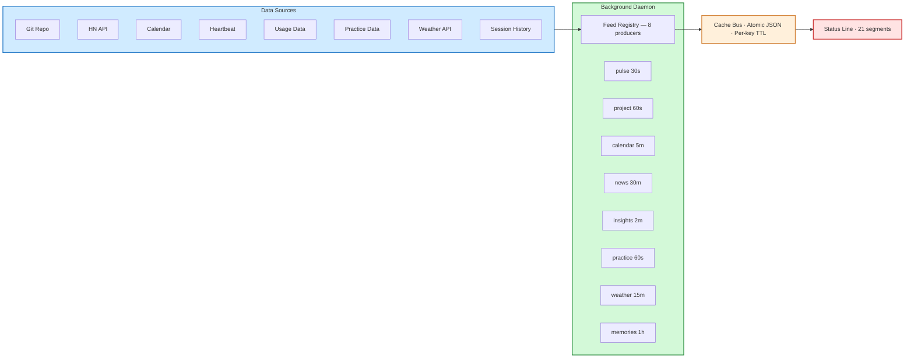

<div align="center">

```
 _                 _            _
| |__   ___   ___ | | ____      _(_)___  ___
| '_ \ / _ \ / _ \| |/ /\ \ /\ / / / __|/ _ \
| | | | (_) | (_) |   <  \ V  V /| \__ \  __/
|_| |_|\___/ \___/|_|\_\  \_/\_/ |_|___/\___|
```

**Awareness framework for AI-augmented development.**

[](https://www.npmjs.com/package/hookwise)
[](https://github.com/vishnujayvel/hookwise/actions)
[](LICENSE)


</div>

## The Problem

AI coding tools are powerful. They're also making developers slower, more burned out, and less aware of what's actually happening in their workflow.

> *"Developers predicted AI would make them 24% faster. They were 19% slower. They still believed they were faster."*
> — [METR Randomized Controlled Trial](https://metr.org/blog/2025-07-10-early-2025-ai-experienced-os-dev-study/), 2025

The research is clear:

- **19% slower** with AI tools, despite feeling faster ([METR RCT, 246 real GitHub issues](https://arxiv.org/abs/2507.09089))
- **45% higher burnout** among frequent AI users ([Quantum Workplace, 700K+ employees](https://www.quantumworkplace.com/press-releases/2024-trends-report))
- **66% spend more time** fixing "almost-right" AI code ([Stack Overflow 2025, 49K+ devs](https://stackoverflow.blog/2025/12/29/developers-remain-willing-but-reluctant-to-use-ai-the-2025-developer-survey-results-are-here/))
- **Trust in AI dropped** from 40% to 29% year-over-year ([Stack Overflow 2025](https://stackoverflow.co/company/press/archive/stack-overflow-2025-developer-survey/))

Harvard researchers studied this for 8 months and found three forms of AI work intensification: **task expansion** (absorbing other roles), **blurred boundaries** (work becomes ambient), and **increased multitasking** (cognitive overload despite *feeling* productive). Their prescription: *intentional pauses, sequencing, and human grounding* ([HBR, Feb 2026](https://hbr.org/2026/02/ai-doesnt-reduce-work-it-intensifies-it)).

**hookwise gives you all three — as a framework, not willpower.**

## Why hookwise?

Your AI keeps you productive. hookwise keeps you **mindful**.

It's a config-driven awareness layer for [Claude Code hooks](https://docs.anthropic.com/en/docs/claude-code/hooks) — one YAML file that adds guard rails, metacognition prompts, workflow insights, and an ambient status line to every session. If hookwise errors, it fails open — your AI keeps working.

> *Guard rails should be boring. The exciting part is what you build when you're not worried about what your AI is doing.*

### Without hookwise

```bash
# .claude/settings.json — one script per guard, scattered across your project
"PreToolUse": [{ "command": "bash scripts/check-rm.sh" }]

# scripts/check-rm.sh  (repeat for every rule...)
#!/bin/bash
INPUT=$(cat)
CMD=$(echo "$INPUT" | jq -r '.tool_input.command // ""')
if echo "$CMD" | grep -q "rm -rf"; then
  echo '{"decision":"block","reason":"dangerous"}'
fi
```

### With hookwise

```yaml
# hookwise.yaml — add a rule, remove a rule, done
guards:
  - match: "Bash"
    action: block
    when: 'tool_input.command contains "rm -rf"'
    reason: "Dangerous command blocked"
```

One file. Claude Code reads it, understands it, and can even help you write new rules. No bash scripts to debug.

## How It Compares

| | hookwise | Raw hook scripts | Status line tools |
|---|---------|-----------------|------------------|
| Guard rails | Declarative YAML | Manual bash | No |
| Testing | GuardTester + HookRunner | Manual | N/A |
| Coaching | Metacognition prompts | No | No |
| Analytics | SQLite, queryable | DIY | Display-only |
| Workflow insights | Friction signals, session pulse | No | No |
| Configuration | One YAML file | Scattered scripts | JSON/TUI |
| Recipes | 12 built-in, shareable | N/A | N/A |
| Cost tracking | Budgets + alerts | DIY | Current session only |

## Quick Start

```bash
npm install -g hookwise
hookwise init --preset minimal
hookwise doctor
```

<div align="center">

</div>

Then [register hookwise in `.claude/settings.json`](docs/guide/getting-started.md) — one dispatcher handles all 13 hook events.

## What You Get

**[Guard Rails](docs/features/guards.md)** -- Declarative rules with firewall semantics. `block` or `warn` with glob patterns and operators like `contains`, `matches`, `starts_with`.


**[Coaching](docs/features/coaching.md)** -- Periodic **metacognition prompts** that break autopilot mode: *"Are you solving the right problem, or the most interesting one?"* Research shows planning-first developers consistently outperform reactive ones ([AIED 2025](https://arxiv.org/html/2509.03171v1)) — hookwise makes planning-first the default.

**[Status Line](docs/features/status-line.md)** -- 21 composable segments powered by a [background daemon](docs/features/feeds.md) with 8 built-in feed producers. Mix `session`, `cost`, `project`, `calendar`, `news`, `insights`, and more. Peripheral vision for your development flow — you don't stare at it, but you glance at it.


**[Workflow Insights](docs/features/feeds.md)** -- Surfaces friction patterns with actionable tips, pace metrics, and session health. The data your workflow already generates but never shows you.

**[Feed Platform](docs/features/feeds.md)** -- A background daemon polls 8 producers on staggered intervals and writes to an atomic cache bus with per-key TTL. Status line segments read from cache with `isFresh()` checks. If a feed is unavailable or stale, its segments silently disappear (fail-open).



**[Analytics](docs/features/analytics.md)** -- SQLite-backed session tracking: tool calls, duration, cost, daily budgets. Close the perception gap between how fast you *feel* and how fast you *are*.


**[Interactive TUI](docs/cli.md)** -- Full-screen dashboard with 8 tabs: dashboard, guards, coaching, analytics, feeds, insights, recipes, status. Auto-launches in a separate terminal when you start Claude Code.

<div align="center">

</div>

## Configuration

Everything lives in `hookwise.yaml`. Four presets: `minimal`, `coaching`, `analytics`, `full`. [Full reference &rarr;](docs/guide/getting-started.md)

```yaml
version: 1
guards:
  - match: "Bash"
    action: block
    when: 'tool_input.command contains "rm -rf"'
    reason: "Dangerous command blocked"
coaching:
  metacognition: { enabled: true, interval_seconds: 300 }
analytics: { enabled: true }
status_line: { enabled: true, segments: [session, cost, project, calendar] }
```

Global config at `~/.hookwise/config.yaml` applies everywhere. Project-level `hookwise.yaml` overrides per workspace.

## Testing

```typescript
import { GuardTester } from "hookwise/testing";
const tester = new GuardTester({ configPath: "hookwise.yaml" });
expect(tester.testToolCall("Bash", { command: "rm -rf /" }).action).toBe("block");
```

Also exports `HookRunner` and `HookResult`. [Details &rarr;](docs/cli.md)

## Recipes

12 built-in -- [see all](recipes/) or [create your own](docs/guide/creating-a-recipe.md):  `block-dangerous-commands`, `metacognition-prompts`, `commit-without-tests`, and more.

## Security

hookwise runs inside your Claude Code session -- security is non-negotiable. The full codebase (~80 source files) is reviewed through a dedicated security pipeline on every release:

- **4-domain parallel review** covering core engine, CLI, feed producers, and Python TUI
- **False-positive filtering** with strict exploitability criteria (confidence >= 8/10)
- **Zero confirmed vulnerabilities** in the latest full-package audit (v1.3.0)

Key design choices: parameterized SQL everywhere, safe YAML parsing only, no `eval()` or `Function()`, restrictive file permissions (0o600/0o700), fail-open architecture, and npm publish with [provenance attestations](https://docs.npmjs.com/generating-provenance-statements).

[Full security policy, trust model, and reporting instructions &rarr;](SECURITY.md)

## Documentation

| Guide | Reference |
|-------|-----------|
| [Getting Started](docs/guide/getting-started.md) | [Guards](docs/features/guards.md) |
| [Creating a Recipe](docs/guide/creating-a-recipe.md) | [Coaching](docs/features/coaching.md) |
| [Architecture](docs/architecture.md) | [Feeds](docs/features/feeds.md) |
| [Philosophy](docs/philosophy.md) | [Status Line](docs/features/status-line.md) |
| [CLI Reference](docs/cli.md) | [Analytics](docs/features/analytics.md) |

## Contributing

`git clone`, `npm install`, `npm test` (1,440 tests), `npm run build`. See [CONTRIBUTING.md](CONTRIBUTING.md).

[MIT](LICENSE) -- Built by [Vishnu](https://github.com/vishnujayvel). *Born from the gap between how fast AI makes you feel — and how fast you actually are.*
</content>
</invoke>