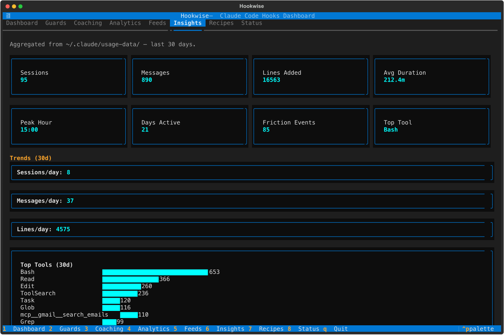
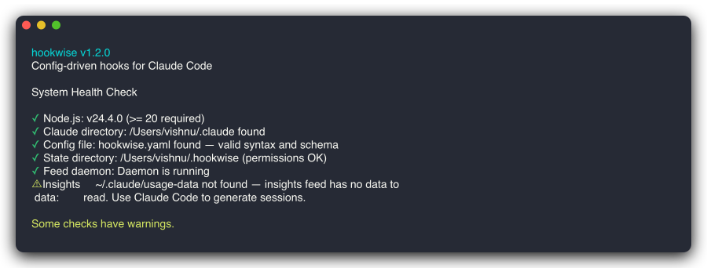
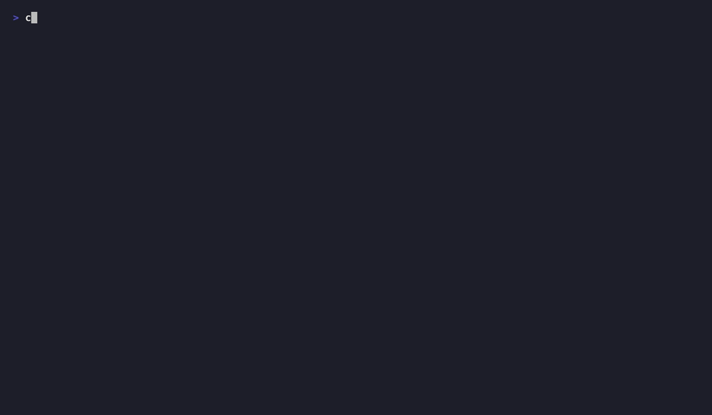
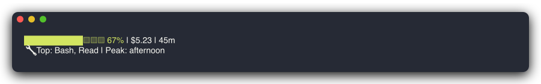
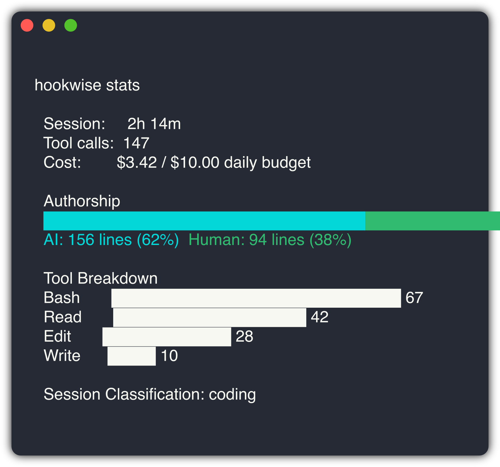
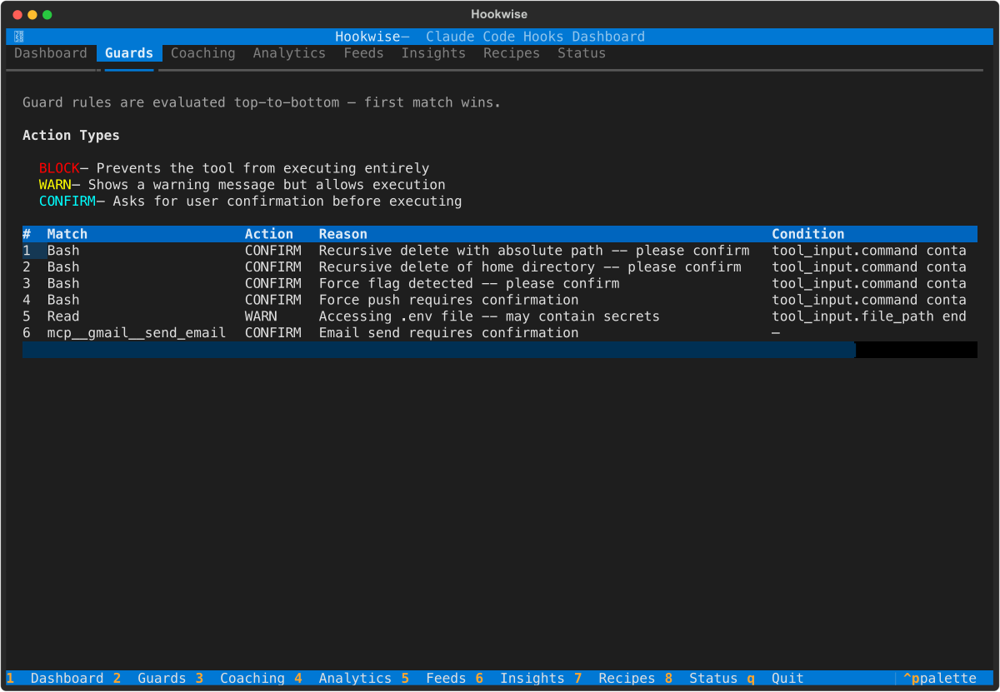

<div align="center">

```
 _                 _            _
| |__   ___   ___ | | ____      _(_)___  ___
| '_ \ / _ \ / _ \| |/ /\ \ /\ / / / __|/ _ \
| | | | (_) | (_) |   <  \ V  V /| \__ \  __/
|_| |_|\___/ \___/|_|\_\  \_/\_/ |_|___/\___|
```

**One YAML file to guard, coach, and observe your Claude Code sessions.**

[](https://www.npmjs.com/package/hookwise)
[](https://github.com/vishnujayvel/hookwise/actions)
[](LICENSE)


<br>
<em>hookwise TUI — your Claude Code usage at a glance</em>

</div>

## Why hookwise?

Claude Code [hooks](https://docs.anthropic.com/en/docs/claude-code/hooks) are powerful but raw -- bash scripts, no testing, no sharing. **hookwise** is one YAML file: declarative guards, testable rules, shareable recipes. If hookwise errors, it fails open -- your AI keeps working.

> *Guard rails should be boring. The exciting part is what you build when you are not worried about what your AI is doing.*

### Without hookwise

```bash
# .claude/settings.json — one script per guard, scattered across your project
"PreToolUse": [{ "command": "bash scripts/check-rm.sh" }]

# scripts/check-rm.sh  (repeat for every rule...)
#!/bin/bash
INPUT=$(cat)
CMD=$(echo "$INPUT" | jq -r '.tool_input.command // ""')
if echo "$CMD" | grep -q "rm -rf"; then
  echo '{"decision":"block","reason":"dangerous"}'
fi
```

### With hookwise

```yaml
# hookwise.yaml — add a rule, remove a rule, done
guards:
  - match: "Bash"
    action: block
    when: 'tool_input.command contains "rm -rf"'
    reason: "Dangerous command blocked"
```

One file. Claude Code reads it, understands it, and can even help you write new rules. No bash scripts to debug.

## How It Compares

| | hookwise | Raw hook scripts | Status line tools |
|---|---------|-----------------|------------------|
| Guard rails | Declarative YAML | Manual bash | No |
| Testing | GuardTester + HookRunner | Manual | N/A |
| Coaching | Metacognition prompts | No | No |
| Analytics | SQLite, queryable | DIY | Display-only |
| Configuration | One YAML file | Scattered scripts | JSON/TUI |
| Recipes | 12 built-in, shareable | N/A | N/A |
| Cost tracking | Budgets + alerts | DIY | Current session only |

## Quick Start

```bash
npm install -g hookwise
hookwise init --preset minimal
hookwise doctor
```

<div align="center">

</div>

Then [register hookwise in `.claude/settings.json`](docs/guide/getting-started.md) — one dispatcher handles all 13 hook events.

## What You Get

**[Guard Rails](docs/features/guards.md)** -- Declarative rules with firewall semantics. `block` or `warn` with glob patterns and operators like `contains`, `matches`, `starts_with`.



**[Coaching](docs/features/coaching.md)** -- Periodic **metacognition prompts** break autopilot mode: *"Are you solving the right problem, or the most interesting one?"*

**[Status Line](docs/features/status-line.md)** -- 21 composable segments powered by a [background daemon](docs/features/feeds.md) with 8 built-in feed producers. Mix `session`, `cost`, `project`, `calendar`, `news`, `insights`, and more.



**[Analytics](docs/features/analytics.md)** -- SQLite-backed session tracking: tool calls, duration, cost, daily budgets.



**[Interactive TUI](docs/cli.md)** -- Full-screen dashboard with 8 tabs: guards, coaching, analytics, feeds, insights, recipes, status. Run `hookwise tui`.



## Configuration

Everything lives in `hookwise.yaml`. Four presets: `minimal`, `coaching`, `analytics`, `full`. [Full reference &rarr;](docs/guide/getting-started.md)

```yaml
version: 1
guards:
  - match: "Bash"
    action: block
    when: 'tool_input.command contains "rm -rf"'
    reason: "Dangerous command blocked"
coaching:
  metacognition: { enabled: true, interval_seconds: 300 }
analytics: { enabled: true }
status_line: { enabled: true, segments: [session, cost, project, calendar] }
```

## Testing

```typescript
import { GuardTester } from "hookwise/testing";
const tester = new GuardTester("hookwise.yaml");
expect(tester.evaluate("Bash", { command: "rm -rf /" }).action).toBe("block");
```

Also exports `HookRunner` and `HookResult`. [Details &rarr;](docs/cli.md)

## Recipes

12 built-in -- [see all](recipes/) or [create your own](docs/guide/creating-a-recipe.md):  `block-dangerous-commands`, `metacognition-prompts`, `commit-without-tests`, and more.

## Documentation

| Guide | Reference |
|-------|-----------|
| [Getting Started](docs/guide/getting-started.md) | [Guards](docs/features/guards.md) |
| [Creating a Recipe](docs/guide/creating-a-recipe.md) | [Coaching](docs/features/coaching.md) |
| [Architecture](docs/architecture.md) | [Feeds](docs/features/feeds.md) |
| [Philosophy](docs/philosophy.md) | [Status Line](docs/features/status-line.md) |
| [CLI Reference](docs/cli.md) | [Analytics](docs/features/analytics.md) |

## Contributing

`git clone`, `npm install`, `npm test` (1,487 tests), `npm run build`. See [CONTRIBUTING.md](CONTRIBUTING.md).

[MIT](LICENSE) -- Built by [Vishnu](https://github.com/vishnujayvel). *Born from watching Claude Code do amazing things -- and occasionally terrifying things.*
