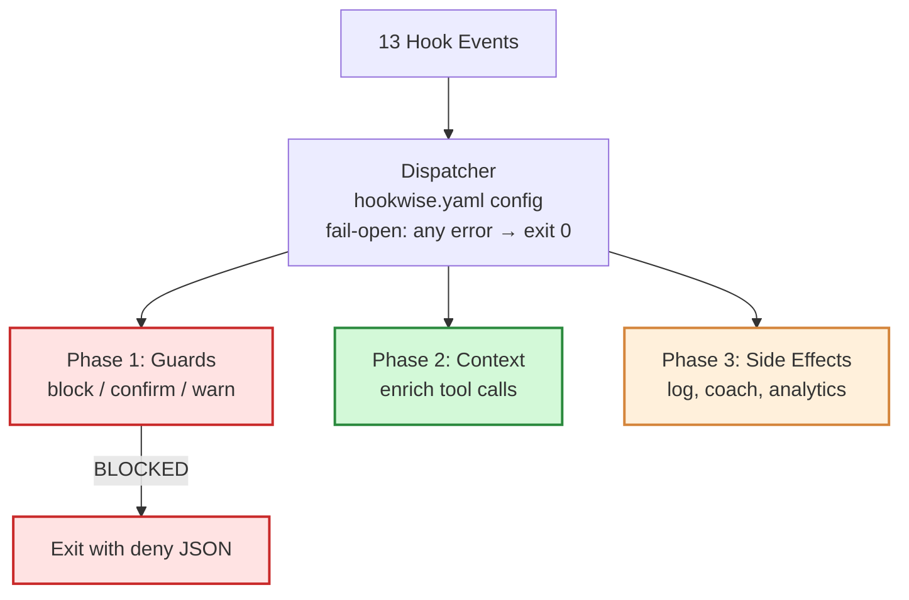
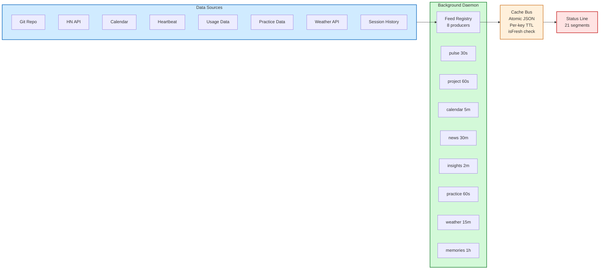

# Architecture

hookwise registers one dispatcher for all 13 Claude Code hook events.

## Three-Phase Engine

> **Diagram source:** three-phase-engine.excalidraw (in docs/assets/) -- open in [Excalidraw](https://excalidraw.com) for an editable hand-drawn version.



### Phase Details

1. **Guards** -- Decide if the tool call should proceed. First block wins (short-circuit). If any guard blocks, phases 2 and 3 are skipped.
2. **Context Injection** -- Enrich the tool call with additional context (greeting, metacognition prompts). Multiple context handlers merge their output.
3. **Side Effects** -- Non-blocking operations that observe and respond (analytics, coaching state, sounds, transcript backup).

### Fail-Open Guarantee

Any unhandled exception anywhere in the dispatch pipeline results in `exit 0`. hookwise must never accidentally block a tool call due to internal errors.

## Feed Platform Architecture

> **Diagram:** Feed platform showing 8 producers polling data sources on staggered intervals, writing to an atomic cache bus, consumed by 21 status line segments.
> **Source:** [feed-platform.excalidraw](assets/feed-platform.excalidraw) -- open in [Excalidraw](https://excalidraw.com) for an editable hand-drawn version.



## Config Resolution

1. Global config (`~/.hookwise/config.yaml`)
2. Project config (`./hookwise.yaml`)
3. Deep merge: project values override global
4. Include resolution (recipes)
5. v0.1.0 backward compatibility transform
6. snake_case to camelCase conversion
7. Environment variable interpolation (`${VAR_NAME}`)
8. Defaults fill missing fields

## Project Structure

```
src/
  core/           # Dispatcher, config, guards, analytics, coaching
    analytics/    # SQLite analytics engine
    coaching/     # Metacognition, builder's trap, communication
    feeds/        # Feed platform: producers, cache bus, registry
    status-line/  # Composable status segments
  cli/            # CLI commands (init, doctor, status, stats, test, migrate)
  testing/        # HookRunner, HookResult, GuardTester

tui/              # Interactive TUI (Python Textual)
  hookwise_tui/   # App, tabs, widgets, data readers

tests/            # 1400+ tests across 61 test files
  core/           # Unit tests for each module
  integration/    # Mock-based integration tests (dispatch flow, pipeline wiring)
  performance/    # Benchmarks and import boundary tests
  cli/            # CLI command tests

recipes/          # 12 built-in recipes
examples/         # 4 example configs (minimal, coaching, analytics, full)
```

---

← [Back to Home](/)
