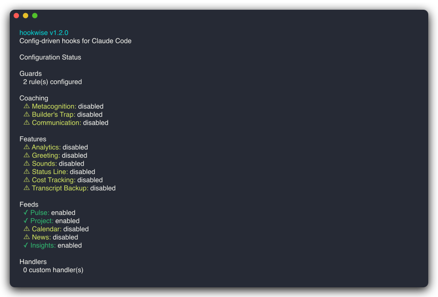

# CLI Commands

All commands are invoked as `hookwise <command>`.

## Commands

```
hookwise init [--preset minimal|coaching|analytics|full]
                          Generate hookwise.yaml and state directory

hookwise doctor           Health check: config, state dir, handlers
```

<div align="center">

</div>

```
hookwise status           Show current configuration summary
```

<div align="center">

</div>

```
hookwise stats            Session analytics: tool calls, duration, cost

hookwise test             Run guard rule tests against scenarios

hookwise tui              Launch the interactive TUI for config management

hookwise feeds [--once]   Live feed dashboard: daemon status, feed health, cache bus
                          Auto-refreshes every 3s; press q to quit. Use --once for snapshot.

hookwise setup <target>   Set up external integrations (e.g., hookwise setup calendar)

hookwise daemon <start|stop|status>
                          Manage the background feed daemon

hookwise migrate          Migrate from Python hookwise (v0.1.0)
```

## Presets

| Preset | What you get |
|--------|-------------|
| `minimal` | Guards only -- just the safety rails |
| `coaching` | Guards + metacognition + builder's trap + status line |
| `analytics` | Guards + SQLite session tracking |
| `full` | Everything enabled |

## Testing Utilities

hookwise includes Go test helpers so you can validate guards in CI:

```go
import hwtesting "github.com/vishnujayvel/hookwise/pkg/hookwise/testing"

func TestGuards(t *testing.T) {
    tester, err := hwtesting.NewGuardTester("hookwise.yaml")
    require.NoError(t, err)

    // Test blocking
    blocked := tester.Evaluate("Bash", map[string]any{"command": "rm -rf /"})
    assert.Equal(t, "block", blocked.Action)

    // Test allowing
    allowed := tester.Evaluate("Bash", map[string]any{"command": "ls -la"})
    assert.Equal(t, "allow", allowed.Action)
}
```

Test helpers available in `pkg/hookwise/testing`:

- **`GuardTester`** -- In-process guard rule evaluation (fast, no subprocess)
- **Contract tests** -- 33 JSON fixtures in `testdata/contracts/` for byte-identical output validation

## Interactive TUI

Full-screen terminal UI built with Python Textual -- 8 tabs:

| Key | Tab | Description |
|-----|-----|-------------|
| `1` | Dashboard | Feature overview with enabled/disabled status |
| `2` | Guards | Guard rules table with action descriptions |
| `3` | Coaching | Coaching features with user-friendly explanations |
| `4` | Analytics | Sparkline trends, tool breakdown, cost tracking |
| `5` | Feeds | Live feed dashboard with auto-refresh and health indicators |
| `6` | Insights | Claude Code usage metrics, trends, and daily AI summary |
| `7` | Recipes | Recipe browser grouped by category |
| `8` | Status | Status line preview and segment configurator |

Press `q` to exit the TUI. Install: `cd tui && pip install -e .`

---

← [Back to Home](/)
