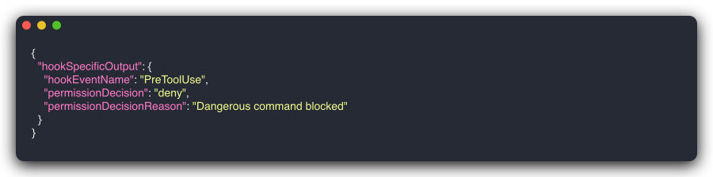

# Guard Rails

Declarative rules evaluated on every `PreToolUse` event. First matching rule wins (firewall semantics).

## Operators

| Operator | Example |
|----------|---------|
| `contains` | `tool_input.command contains "rm -rf"` |
| `starts_with` | `tool_input.file_path starts_with "/etc"` |
| `ends_with` | `tool_input.file_path ends_with ".env"` |
| `equals` / `==` | `tool_name equals "Bash"` |
| `matches` | `tool_input.command matches "git push.*--force"` |

## Actions

Three actions are available:

- **block** -- Reject the tool call outright. The tool does not execute.
- **confirm** -- Reserved for future use. Currently behaves identically to block (see note below).
- **warn** -- Log the match and continue. The tool call proceeds.

> **Note:** In v1.0, `confirm` behaves identically to `block`. Claude Code hooks do not support interactive confirmation dialogs. The `confirm` action is reserved for future use when Claude Code adds confirmation support.

## Guard Block Demo

<div align="center">

<br>
<em>A guard rule blocks rm -rf and returns a deny decision</em>
</div>

<details>
<summary>Guard deny JSON output</summary>

<div align="center">

</div>
</details>

## Glob Patterns

Glob patterns for tool names: `mcp__gmail__*` matches all Gmail MCP tools.

```yaml
guards:
  - match: "mcp__gmail__*"
    action: confirm
    reason: "Gmail tool requires confirmation"
```

## Example Configuration

```yaml
guards:
  - match: "Bash"
    action: block
    when: 'tool_input.command contains "rm -rf"'
    reason: "Dangerous command blocked"

  - match: "Bash"
    action: confirm
    when: 'tool_input.command contains "--force"'
    reason: "Force flag requires confirmation"

  - match: "Read"
    action: warn
    when: 'tool_input.file_path ends_with ".env"'
    reason: "Accessing .env file -- may contain secrets"
```

---

← [Back to Home](/)
