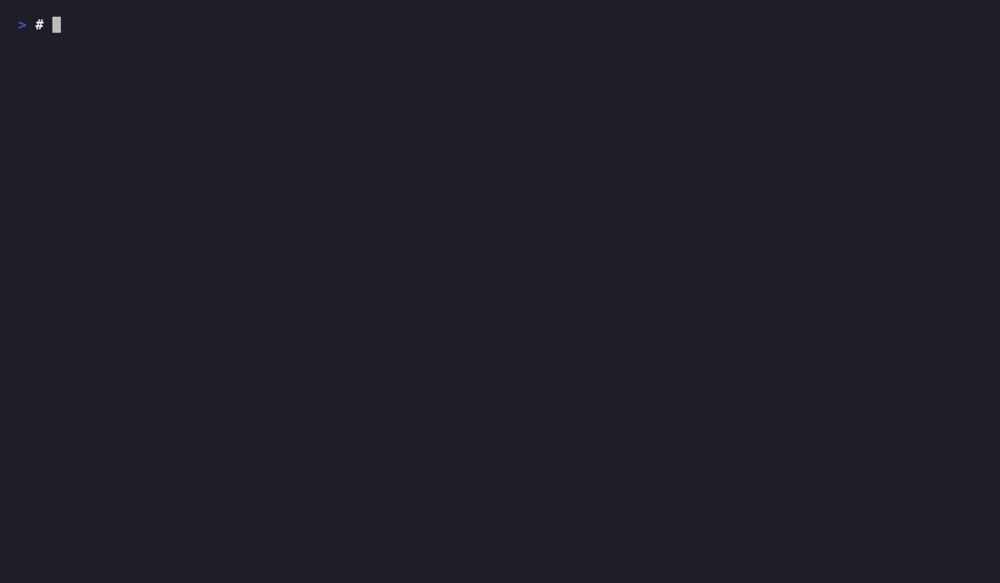

# Composable Status Line

21 segments you can mix and match to build a personalized status line.

<div align="center">

<br>
<em>Status line adapts -- green at start, yellow mid-session, red when overdue</em>
</div>

## Core Segments

| Segment | Shows |
|---------|-------|
| `clock` | Current time |
| `session` | Duration + tool count |
| `cost` | Session cost estimate |
| `builder_trap` | Alert level + nudge message |
| `mantra` | Rotating motivational prompt |
| `practice` | Daily practice rep counter |
| `streak` | Coding streak counter |

## Two-Tier Segments

| Segment | Shows |
|---------|-------|
| `context_bar` | Context window usage bar |
| `mode_badge` | Current mode (coding/tooling/etc.) |
| `duration` | Total session duration |
| `practice_breadcrumb` | Time since last practice |

## Feed Platform Segments

| Segment | Shows |
|---------|-------|
| `pulse` | Session heartbeat |
| `project` | Repo + branch + last commit |
| `calendar` | Current/next event |
| `news` | Hacker News headlines |

## Insights Segments

| Segment | Shows |
|---------|-------|
| `insights_friction` | Friction health: warns on recent friction, shows clean status otherwise |
| `insights_pace` | Productivity: messages/day, total lines, session count |
| `insights_trend` | Patterns: top tools and peak coding hour |

## Additional Segments

| Segment | Shows |
|---------|-------|
| `weather` | Local temperature, conditions, and wind indicator |
| `memories` | "On this day" session history and nostalgia |
| `ai_ratio` | AI authorship percentage with progress bar |

## Configuration

```yaml
status_line:
  enabled: true
  segments:
    - session
    - builder_trap
    - cost
    - project
```

---

← [Back to Home](/)
