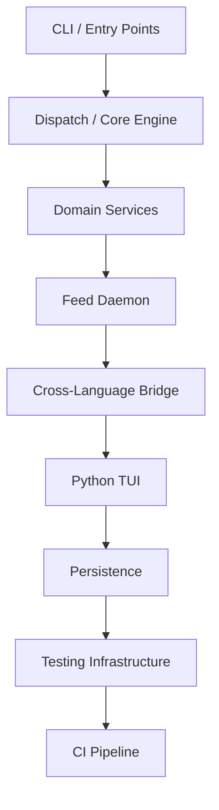

# Architecture Specification

> Generated by openlore v1.0.0 on 2026-06-15 15:11

## Purpose

This document describes the architectural patterns and structure of the system.

## Architecture Style

Layered architecture: CLI entry points (cmd/hookwise) → dispatch/core engine (internal/core) →
domain service layer (analytics, feeds, notifications, coaching) → SQLite persistence. The layering
is justified by the need to keep the hot-path dispatch pipeline (called synchronously by Claude Code
on every hook event) completely isolated from slower concerns like feed polling, TUI rendering, and
analytics aggregation. A strict cross-language boundary separates Go (dispatch, daemon, analytics)
from Python (TUI) via a JSON file cache rather than a shared process or socket.

## Requirements

### Requirement: LayeredArchitecture

The system SHALL maintain separation between:
- CLI / Entry Points (Cobra command handlers that are the public surface area: dispatch events, doctor, stats, status-line, daemon lifecycle, init/wire, migrate, notifications, test.)
- Dispatch / Core Engine (Three-phase pipeline (declarative guards → handler guard/context phases → async side effects) with fail-open guarantee. Hub of the entire system.)
- Domain Services (Self-contained service modules for analytics, feeds, coaching, notifications, pricing, and hook-safety analysis. Each owns its own DB tables or cache files.)
- Feed Daemon (Background process that polls registered producers on staggered intervals, wraps output in canonical FeedEnvelope, and atomically writes JSON cache files to disk. Never touches the analytics DB (ARCH-3).)
- Cross-Language Bridge (Translates Go daemon feed envelopes into the flat JSON schema the Python TUI expects. FeedEnvelope is the canonical boundary type; TUIBridgeService handles the transformation and atomic write.)
- Python TUI (Textual-based terminal dashboard that reads the flat JSON cache file written by the Go bridge and renders live status, feeds, analytics, and coaching state.)
- Persistence (SQLite database (WAL mode, single-writer via SetMaxOpenConns(1)) for analytics events, sessions, authorship ledger, coaching state, cost state, notifications, and feed cache. Snapshot service manages VACUUM INTO copies.)
- Testing Infrastructure (Multi-tier testing: contract fixtures (byte-identical stdout), architecture linting, property-based tests, chaos/integration tests, mutation tests, and a terminal harness for E2E TUI testing.)
- CI Pipeline (Dagger-based containerized pipeline that runs vet, compile, lint, unit, contract, arch, PBT, TUI, integration, mutation, and snapshot tests — identical locally and in GitHub Actions.)

#### Scenario: LayerSeparation
- **GIVEN** a request from the presentation layer
- **WHEN** business logic is needed
- **THEN** the presentation layer delegates to the business layer
- **AND** direct database access from presentation is prohibited

### Requirement: SecurityModel

The system SHALL implement security via: No traditional authentication or authorization. The guard engine acts as the policy enforcement layer: declarative GuardRuleConfig rules intercept tool calls before execution, and BlockDangerousCommandsHandler matches Bash invocations against configurable dangerous-pattern lists. SecretScanningService detects accidental credential exposure in Write/Edit tool payloads by matching file paths against sensitive-file patterns and content against known API key regexes, emitting a warn GuardResult. Google Calendar integration uses OAuth2 with tokens persisted to disk; all other external APIs are unauthenticated public endpoints. Config files are local YAML with no network fetch; the set-secret script ensures secret values never enter conversation context or shell history.

#### Scenario: AuthenticatedAccess
- **GIVEN** an unauthenticated request
- **WHEN** accessing protected resources
- **THEN** access is denied

## System Diagram

## Layer Structure

### CLI / Entry Points

**Purpose**: Cobra command handlers that are the public surface area: dispatch events, doctor, stats, status-line, daemon lifecycle, init/wire, migrate, notifications, test.
**Location**: `cmd/hookwise/cmd_dispatch.go, cmd/hookwise/cmd_doctor.go, cmd/hookwise/cmd_status_line.go, cmd/hookwise/cmd_daemon.go, cmd/hookwise/cmd_stats.go, cmd/hookwise/cmd_init.go`

### Dispatch / Core Engine

**Purpose**: Three-phase pipeline (declarative guards → handler guard/context phases → async side effects) with fail-open guarantee. Hub of the entire system.
**Location**: `internal/core/dispatcher.go, internal/core/guards.go, internal/core/config.go, internal/core/phase_executor.go, internal/core/side_effect_executor.go, internal/core/response_formatter.go, internal/core/handler_resolver.go, internal/core/handler_executor.go`

### Domain Services

**Purpose**: Self-contained service modules for analytics, feeds, coaching, notifications, pricing, and hook-safety analysis. Each owns its own DB tables or cache files.
**Location**: `internal/analytics/, internal/feeds/, internal/notifications/, internal/migration/, internal/perf/`

### Feed Daemon

**Purpose**: Background process that polls registered producers on staggered intervals, wraps output in canonical FeedEnvelope, and atomically writes JSON cache files to disk. Never touches the analytics DB (ARCH-3).
**Location**: `internal/feeds/daemon.go, internal/feeds/polling.go, internal/feeds/producer.go, internal/feeds/weather.go, internal/feeds/news.go, internal/feeds/calendar.go, internal/feeds/project.go, internal/feeds/insights.go, internal/feeds/memories.go`

### Cross-Language Bridge

**Purpose**: Translates Go daemon feed envelopes into the flat JSON schema the Python TUI expects. FeedEnvelope is the canonical boundary type; TUIBridgeService handles the transformation and atomic write.
**Location**: `internal/bridge/, internal/feeds/envelope.go`

### Python TUI

**Purpose**: Textual-based terminal dashboard that reads the flat JSON cache file written by the Go bridge and renders live status, feeds, analytics, and coaching state.
**Location**: `tui/hookwise_tui/app.py, tui/hookwise_tui/data.py, tui/tests/`

### Persistence

**Purpose**: SQLite database (WAL mode, single-writer via SetMaxOpenConns(1)) for analytics events, sessions, authorship ledger, coaching state, cost state, notifications, and feed cache. Snapshot service manages VACUUM INTO copies.
**Location**: `internal/analytics/db.go, internal/analytics/state.go, internal/analytics/snapshot.go`

### Testing Infrastructure

**Purpose**: Multi-tier testing: contract fixtures (byte-identical stdout), architecture linting, property-based tests, chaos/integration tests, mutation tests, and a terminal harness for E2E TUI testing.
**Location**: `testdata/contracts/, internal/arch/, internal/proptest/, internal/chaos/, internal/mutation/, tui/tests/terminal_harness/, pkg/hookwise/testing/`

### CI Pipeline

**Purpose**: Dagger-based containerized pipeline that runs vet, compile, lint, unit, contract, arch, PBT, TUI, integration, mutation, and snapshot tests — identical locally and in GitHub Actions.
**Location**: `dagger/, .github/workflows/`

## Data Flow

Claude Code fires a lifecycle event → hookwise dispatch reads JSON payload from stdin →
ConfigService loads/merges global+project YAML → GuardService evaluates declarative rules
(first-match-wins, ARCH-5) → PhaseExecutor runs handler-based guard phase then context phase
sequentially → ResponseFormatter emits spec-compliant JSON to stdout (always exit 0, ARCH-1) →
SideEffectExecutor fires async handlers in background goroutines with per-goroutine recover()
(ARCH-7) → AnalyticsService records event/session/authorship to SQLite WAL DB → separately,
FeedPollingService in the daemon polls producers on staggered intervals → each producer wraps output
in FeedEnvelope → TUIBridgeService flattens envelope to Python-compatible schema and atomically
writes status-line-cache.json → Python TUI reads cache file on tick and renders dashboard; warnings
flow through WarningCollector → state directory JSON files → TUI warning segment; notifications flow
through NotificationProducerService → SQLite notifications table → surfaced via CLI or TUI segment.

## External Integrations

| System | Purpose |
|--------|---------|
| Claude Code (hook events via stdin/stdout JSON protocol; settings.json wiring) | External integration |
| Open-Meteo API (weather feed — free, no API key required) | External integration |
| Hacker News API (news feed — public, concurrent story fetch) | External integration |
| Google Calendar API (OAuth2, token refresh, persisted in Python-compatible format) | External integration |
| Anthropic Claude Haiku API (LLM-generated daily insights narrative, cached to disk) | External integration |
| SQLite via modernc.org/sqlite (pure-Go, CGO-free, WAL mode — analytics, coaching, cost, notifications) | External integration |
| Unix domain sockets (daemon IPC for health probe and graceful shutdown) | External integration |
| Git CLI (project feed shells out to git for branch/commit/dirty-state context) | External integration |
